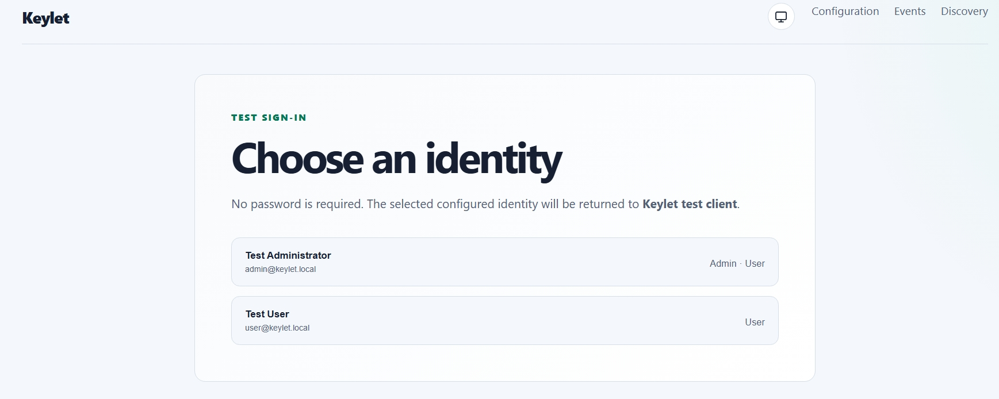
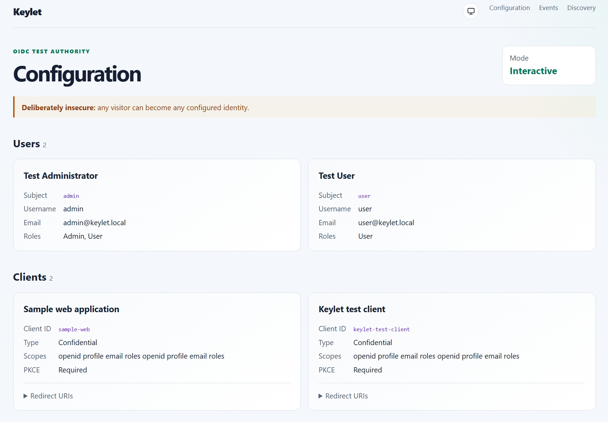

# Keylet

Keylet is a deliberately insecure, configuration-only OpenID Connect provider for development and automated tests. It behaves like the useful OIDC surface of Keyla without Identity, PostgreSQL, passwords, account administration, or dynamic client registration.

It supports:

- authorization code flow with S256 PKCE;
- discovery, JWKS, token, userinfo, and end-session endpoints;
- confidential and public configured clients;
- configured `sub`, name, username, email, verification, and role claims;
- an interactive one-click account picker;
- automatic login with a default user and optional `login_hint` selection;
- an in-memory event view at `/events`;
- structured event logs, custom event spans, ASP.NET Core spans, runtime/HTTP metrics, and OTLP export;
- health endpoints at `/health` and `/alive`;
- an Aspire AppHost and an OCI image definition.
- a separate ASP.NET Core test client that exercises login, userinfo, claims, session cookies, events, and logout.

> Keylet provides no authentication before impersonation. Never expose it as a production or shared authority.

## Screenshots

<p></p>

<p></p>

## Run with Aspire

```powershell
aspire start --non-interactive
aspire wait keylet --non-interactive
aspire wait test-client --non-interactive
```

The AppHost uses the `arturek/keylet` container image by default. To debug the local `src/Keylet` project instead, set the Aspire parameter to `false` before starting it:

```powershell
aspire start --non-interactive -- Parameters:keylet-use-container=false
```

The selected resource keeps the same `keylet` name and endpoint contract, so the test client wiring remains unchanged.

Open the `test-client` HTTPS endpoint shown by `aspire describe`. Its **Sign in with Keylet** button starts the real authorization-code flow, and **Sign out through Keylet** exercises end-session and the signed-out callback. The page shows:

- authenticated name, stable subject, email, roles, and cookie issue/expiry metadata;
- every resulting claim and its issuer;
- the client's OIDC middleware events without codes, tokens, PKCE verifiers, cookies, or secrets;
- a link to Keylet's provider-side `/events` timeline.

The AppHost injects Keylet's allocated HTTPS endpoint into the test client and the test client's callback endpoints into Keylet, so the flow does not depend on hard-coded Aspire proxy ports.

A different consuming project in the same AppHost can receive the authority the same way:

```csharp
var keylet = builder.AddProject<Projects.Keylet>("keylet")
    .WithExternalHttpEndpoints();

builder.AddProject<Projects.MyApp>("app")
    .WithEnvironment("Authentication__Keyla__Authority", keylet.GetEndpoint("https"))
    .WithEnvironment("Authentication__Keyla__ClientId", "sample-web")
    .WithEnvironment("Authentication__Keyla__ClientSecret", "sample-web-secret")
    .WaitFor(keylet);
```

The application's browser callback URI still has to appear in `Keylet:Clients[*]:RedirectUris`.

## Test client outside Aspire

The defaults use Keylet at `https://localhost:7284` and the client at `https://localhost:7294`:

```powershell
dotnet run --project .\src\Keylet.TestClient\Keylet.TestClient.csproj --launch-profile https
```

Override `Authentication:Keylet:Authority`, `ClientId`, `ClientSecret`, or `RequireHttpsMetadata` through normal ASP.NET Core configuration when testing another Keylet instance. The test client intentionally uses `SaveTokens = false`; it proves token exchange and validation without persisting token values in its cookie.

## Configuration

Configuration is read at startup from normal ASP.NET Core providers. JSON is clearest for lists; environment-variable overrides use double underscores, for example `Keylet__Mode=Automatic`.

```json
{
  "Keylet": {
    "Issuer": "https://keylet.example.test",
    "Mode": "Interactive",
    "AutomaticUser": "admin",
    "AllowLoginHint": true,
    "AllowInsecureHttp": false,
    "EventCapacity": 500,
    "Users": [
      {
        "Subject": "admin",
        "Name": "Test Administrator",
        "PreferredUsername": "admin",
        "Email": "admin@example.test",
        "EmailVerified": true,
        "Roles": [ "Admin", "User" ]
      }
    ],
    "Clients": [
      {
        "ClientId": "my-app",
        "ClientSecret": "local-test-secret",
        "DisplayName": "My application",
        "RedirectUris": [ "https://localhost:7180/signin-oidc" ],
        "PostLogoutRedirectUris": [ "https://localhost:7180/signout-callback-oidc" ],
        "AllowedScopes": [ "openid", "profile", "email", "roles" ],
        "AllowRefreshTokens": false,
        "RequirePkce": true
      }
    ]
  }
}
```

`Issuer` is optional. When omitted, OpenIddict derives it from the request, which works well with Aspire's endpoint proxy. Set it when the service runs behind a stable reverse-proxy address. Plain HTTP is accepted only when `AllowInsecureHttp` is true; a consuming ASP.NET Core OIDC handler then also needs `RequireHttpsMetadata = false`.

Client secrets are intentionally fixed test data. The configuration page shows whether a client is public or confidential but never renders its secret.

Signing and encryption keys, grants, and event history are ephemeral. Restarting Keylet invalidates previously issued tokens, which keeps test runs isolated.

### Automated mode

Set `Keylet:Mode` to `Automatic`. Authorization requests immediately use `AutomaticUser`. When `AllowLoginHint` is true, a request may select another configured identity by subject, preferred username, or email:

```text
/connect/authorize?...&login_hint=user
```

This keeps browser automation out of most integration tests while allowing multi-user scenarios. It does not weaken PKCE or redirect URI validation.

## Events and OpenTelemetry

`/events` shows the bounded in-memory identity/protocol timeline. It includes configuration load, interactive or automatic account selection, authorization, token, userinfo, discovery/JWKS, and logout traffic. It never stores authorization codes, tokens, PKCE verifiers, or client secrets.

Every event is also emitted as a structured `Information` log and a span from the `Keylet.Events` activity source. ServiceDefaults also emits ASP.NET Core/HTTP/runtime telemetry. Set the standard exporter variables to send all of it to an OTLP collector:

```text
OTEL_EXPORTER_OTLP_ENDPOINT=http://collector:4317
OTEL_EXPORTER_OTLP_PROTOCOL=grpc
OTEL_SERVICE_NAME=keylet
```

## Image

Build with the repository root as context:

```powershell
wslc build -f src/Keylet/Dockerfile -t keylet:local .
```

The image listens on port `8080`. Mount a JSON configuration file or provide indexed environment variables such as `Keylet__Users__0__Subject` and `Keylet__Clients__0__RedirectUris__0`.

### GitHub Actions, GHCR, and Docker Hub

`.github/workflows/build.yaml` builds the image for pull requests and builds and publishes it for `main` pushes or manual runs. Published images use the repository path in GitHub Container Registry, for example:

```text
ghcr.io/arturek/keylet:1.0.0-beta.1
```

Configure this non-secret Actions variable at repository, owner/organization, or global scope. The value is the Docker Hub registry hostname with an optional port and must not include `https://` or a path:

- `DOCKERHUB_REGISTRY`: Docker Hub registry hostname, normally `docker.io`.

The build workflow uses the repository-provided `GITHUB_TOKEN` with `packages: write` permission to publish to GHCR. Pull-request runs do not log in or publish images. A successful `main` build publishes both the NBGV version and `latest`.

`.github/workflows/publish-dockerhub.yaml` is manual only. Supply an existing GHCR image tag when starting it. It promotes that exact image to `<DOCKERHUB_REGISTRY>/<DOCKERHUB_USERNAME>/keylet:<tag>` without rebuilding it and can optionally update `latest`.

Configure these repository secrets before using the Docker Hub workflow:

- `DOCKERHUB_USERNAME`: Docker Hub account or namespace that owns the `keylet` repository;
- `DOCKERHUB_TOKEN`: Docker Hub access token with permission to push that repository.

### Aspire hosting package

The `Keylet.Hosting.Aspire` package runs the Docker Hub image directly from an Aspire AppHost:

```powershell
dotnet add package Keylet.Hosting.Aspire
```

```csharp
using Keylet.Hosting.Aspire;

var keylet = builder.AddKeylet();
var app = builder.AddProject<Projects.MyApp>("app")
    .WithExternalHttpEndpoints()
    .WithKeyletAuthentication(keylet, "my-app", "local-development-secret")
    .WaitFor(keylet);

keylet.WithKeyletClient(
    app,
    clientId: "my-app",
    clientSecret: "local-development-secret");
```

The helper defaults `RequireHttpsMetadata` to `false` because the Docker image exposes HTTP for local development. Set `requireHttpsMetadata: true` when Keylet is fronted by HTTPS.

`.github/workflows/publish-nuget.yaml` builds the package on pull requests and publishes it on tags or manual runs using NuGet Trusted Publishing. Configure a NuGet Trusted Publishing policy for repository `arturek/keylet`, workflow `publish-nuget.yaml`, and provide the NuGet profile name as the `NUGET_USER` repository secret. The workflow requests a short-lived OIDC API key and does not require a long-lived NuGet API key.

## Validation

```powershell
dotnet build Keylet.slnx --no-restore
dotnet test --project tests\Keylet.Tests\Keylet.Tests.csproj --no-build
```
